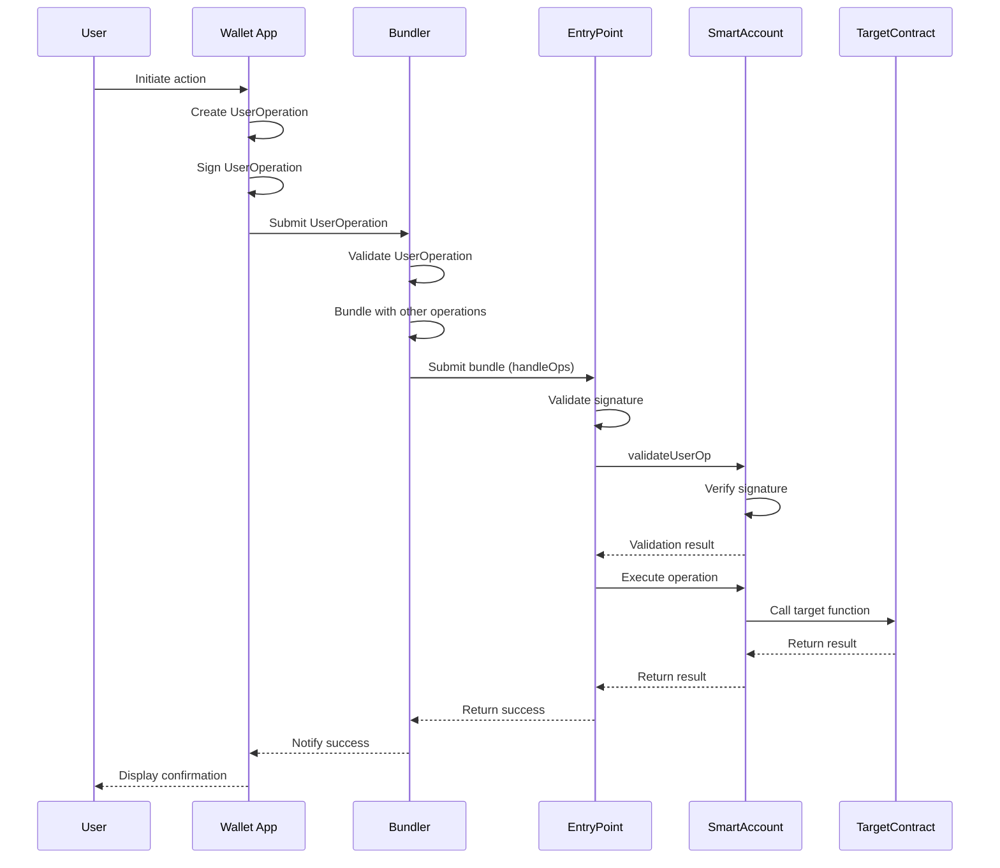
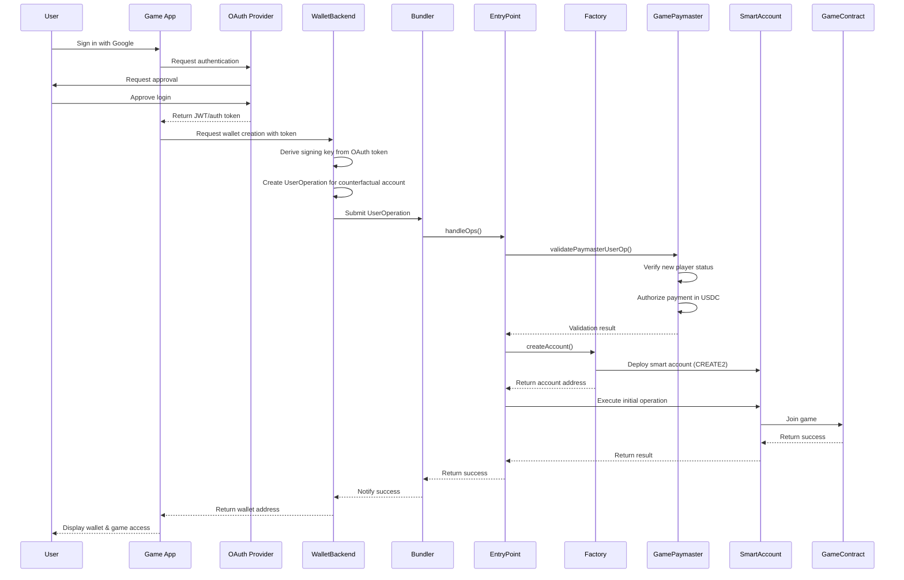
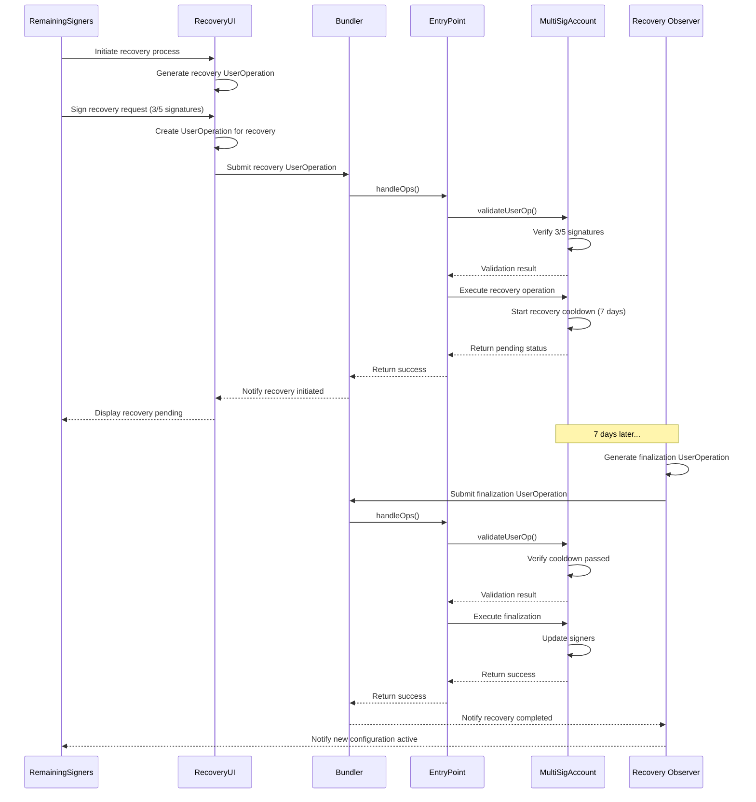
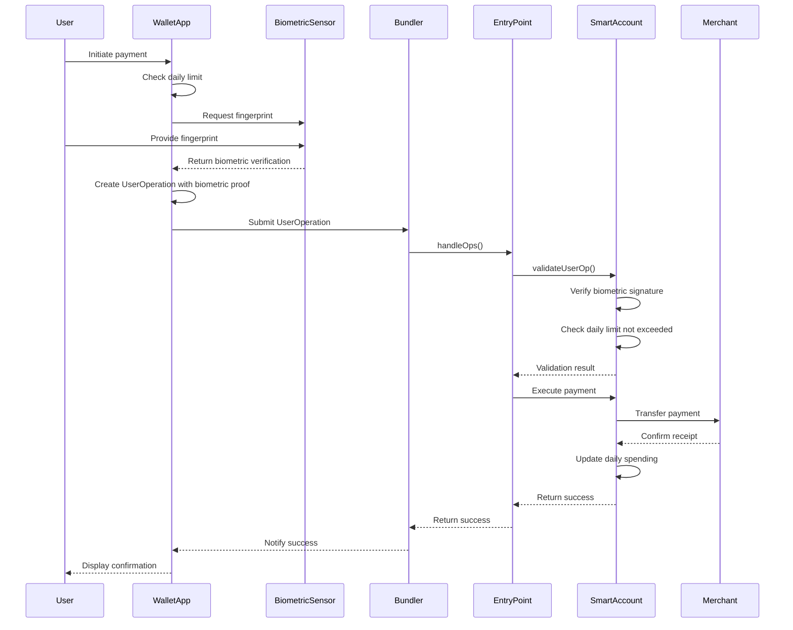
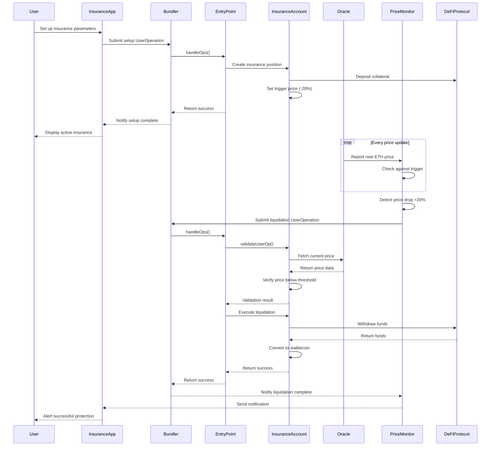
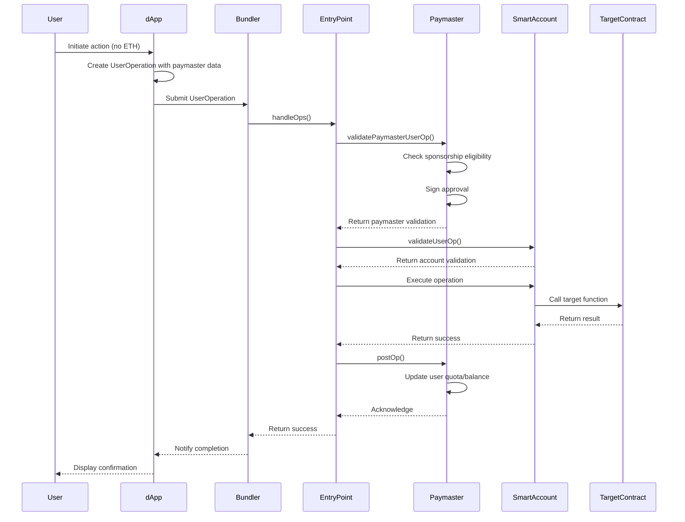
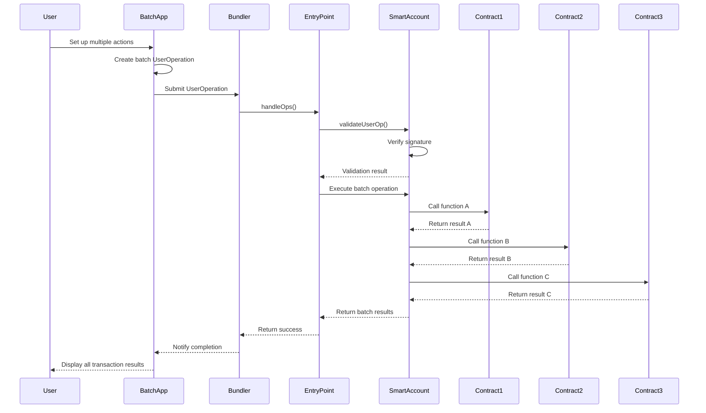

# ERC-4337 Account Abstraction Sequence Diagrams

## 1. Basic UserOperation Flow

### Explicação do Fluxo Básico de UserOperation

Este diagrama mostra o fluxo fundamental de uma transação usando ERC-4337, desde a ação do usuário até a execução final no blockchain:

1. **Iniciação pelo Usuário**: O processo começa quando um usuário inicia uma ação (como enviar tokens) em sua carteira.
2. **Criação e Assinatura**: A aplicação da carteira cria uma estrutura chamada UserOperation (não uma transação tradicional) e a assina digitalmente.
3. **Submissão ao Bundler**: A operação é enviada a um Bundler, que é um serviço especializado que agrupa operações de usuários.
4. **Validação e Agrupamento**: O Bundler valida preliminarmente a operação e a agrupa com outras operações para processamento em lote.
5. **Entrada no Contrato EntryPoint**: O Bundler envia o pacote de operações para o contrato singleton EntryPoint, que é o ponto de entrada único para todas as operações.
6. **Validação em Cadeia**: O EntryPoint verifica a assinatura e solicita à conta inteligente do usuário para validar a operação.
7. **Execução da Operação**: Após validação bem-sucedida, o EntryPoint instrui a conta inteligente a executar a operação desejada.
8. **Interação com Contratos-Alvo**: A conta inteligente interage com o contrato-alvo especificado pelo usuário.
9. **Confirmação de Resultado**: O resultado flui de volta através da cadeia de componentes até o usuário, que recebe uma confirmação.

Este fluxo permite transações complexas sem exigir que o usuário possua ETH diretamente, separando a assinatura da operação do pagamento das taxas de gas.

## 2. Social Login Wallet Creation & First Transaction

### Explicação do Fluxo de Criação de Carteira com Login Social

Este diagrama ilustra como um jogo pode criar uma carteira para um novo jogador usando autenticação social, sem necessidade de conhecimento prévio de criptomoedas:

1. **Login Social**: O usuário simplesmente faz login no jogo usando sua conta Google existente.
2. **Autenticação OAuth**: O jogo solicita autenticação através do provedor OAuth e recebe um token JWT após aprovação do usuário.
3. **Solicitação de Criação de Carteira**: O jogo envia o token para um serviço de backend de carteira.
4. **Derivação de Chaves**: O backend deriva uma chave de assinatura a partir do token de autenticação.
5. **Operação para Conta Contrafactual**: Cria uma UserOperation para uma conta que ainda não existe na blockchain (contrafactual).
6. **Patrocínio pelo Jogo**: O GamePaymaster do jogo verifica que é um novo jogador e autoriza o pagamento das taxas em USDC.
7. **Criação da Conta Inteligente**: O Factory implanta a carteira inteligente usando CREATE2 (permitindo endereços determinísticos).
8. **Execução da Primeira Transação**: A nova conta automaticamente executa uma operação para juntar-se ao jogo.
9. **Acesso Imediato**: O usuário recebe acesso ao jogo e à sua nova carteira sem nunca ter que comprar ETH ou entender chaves privadas.

Este fluxo demonstra como o ERC-4337 pode eliminar as barreiras de entrada ao mundo cripto, permitindo uma experiência de usuário semelhante aos aplicativos Web2.

## 3. Corporate Wallet Recovery Process

### Explicação do Processo de Recuperação de Carteira Corporativa

Este diagrama mostra como uma empresa pode recuperar acesso a uma carteira multisig após perder dispositivos ou chaves de acesso:

1. **Iniciação do Processo**: Os signatários remanescentes (3 de 5) iniciam o processo de recuperação através de uma interface específica.
2. **Assinatura do Pedido**: Cada signatário remanescente fornece sua assinatura para autorizar a recuperação.
3. **Submissão da Operação**: A interface cria e submete uma UserOperation de recuperação.
4. **Validação de Assinaturas**: A conta multisig verifica que há assinaturas suficientes (3/5) para autorizar a recuperação.
5. **Período de Segurança**: A conta inicia um período de espera de 7 dias como medida de segurança.
6. **Notificação de Pendência**: Os signatários são notificados que a recuperação foi iniciada e está pendente.
7. **Finalização após Espera**: Após 7 dias, um observador (geralmente um serviço automatizado) submete uma operação de finalização.
8. **Verificação de Período**: A conta verifica que o período de espera foi completado.
9. **Atualização de Signatários**: A conta atualiza a lista de signatários autorizados.
10. **Confirmação**: Os signatários são notificados que a nova configuração está ativa.

Este mecanismo proporciona segurança para contas corporativas, permitindo recuperação sem seed phrases e implementando um período de segurança que permite contestação caso a recuperação tenha sido iniciada fraudulentamente.

## 4. Biometric Authentication with Daily Limit

### Explicação do Fluxo de Autenticação Biométrica com Limite Diário

Este diagrama demonstra como combinar autenticação biométrica com limites de gastos diários para criar uma carteira segura e prática:

1. **Iniciação de Pagamento**: O usuário inicia um pagamento em sua aplicação de carteira.
2. **Verificação de Limite**: A aplicação verifica se o pagamento está dentro do limite diário estabelecido.
3. **Autenticação Biométrica**: O sistema solicita a impressão digital do usuário através do sensor biométrico do dispositivo.
4. **Prova de Identidade**: O usuário fornece sua impressão digital, que é convertida em uma verificação.
5. **Criação de Operação**: A aplicação cria uma UserOperation incluindo a prova biométrica.
6. **Validação na Blockchain**: A conta inteligente verifica tanto a assinatura biométrica quanto o cumprimento do limite diário.
7. **Execução do Pagamento**: Após validação, a conta executa o pagamento para o comerciante.
8. **Atualização de Gastos**: A conta atualiza o contador de gastos diários.
9. **Confirmação ao Usuário**: O usuário recebe confirmação do pagamento concluído.

Este fluxo mostra como o ERC-4337 permite combinar segurança biométrica (normalmente disponível apenas em dispositivos) com lógica on-chain (limites diários), criando uma experiência superior às carteiras tradicionais.

## 5. Automated DeFi Insurance with Price Monitoring

### Explicação do Seguro DeFi Automatizado com Monitoramento de Preço

Este diagrama ilustra como criar um sistema de seguro automático contra quedas de preço em ativos cripto:

1. **Configuração do Seguro**: O usuário define parâmetros de seguro (como gatilho de preço) na aplicação.
2. **Criação da Posição**: A conta de seguro cria uma posição de seguro, depositando colateral no protocolo DeFi.
3. **Definição de Gatilho**: É configurado um gatilho de preço (queda de 20%) para ativar a liquidação automática.
4. **Monitoramento Contínuo**: Um oráculo de preços fornece atualizações de preço a um monitor dedicado.
5. **Detecção de Queda**: O monitor detecta quando o preço cai abaixo do limite de 20%.
6. **Gatilho de Liquidação**: O monitor submete uma UserOperation solicitando liquidação.
7. **Verificação On-chain**: A conta de seguro verifica novamente os dados de preço diretamente do oráculo.
8. **Execução da Proteção**: A conta retira os fundos do protocolo DeFi e os converte para stablecoin.
9. **Notificação ao Usuário**: O usuário é notificado sobre a proteção bem-sucedida.

Este fluxo demonstra a capacidade do ERC-4337 de criar sistemas automatizados que reagem a eventos externos (quedas de preço) sem intervenção manual do usuário, protegendo ativos em situações de alta volatilidade.

## 6. Paymaster-Sponsored Transaction Flow

### Explicação do Fluxo de Transação Patrocinada por Paymaster

Este diagrama ilustra como um usuário pode realizar transações sem possuir ETH, utilizando um patrocinador:

1. **Iniciação sem ETH**: O usuário inicia uma ação no dApp, mesmo sem possuir ETH para taxas.
2. **Inclusão de Paymaster**: O dApp cria uma UserOperation incluindo dados do Paymaster (patrocinador).
3. **Validação pelo Paymaster**: O EntryPoint solicita ao Paymaster que valide a operação.
4. **Verificação de Elegibilidade**: O Paymaster verifica se o usuário é elegível para patrocínio (ex: cliente premium, novo usuário).
5. **Aprovação do Patrocínio**: O Paymaster assina a aprovação para pagar as taxas de gas.
6. **Validação da Conta**: O EntryPoint solicita validação da operação pela conta do usuário.
7. **Execução Normal**: A transação é executada normalmente no contrato-alvo.
8. **Callback pós-operação**: Após a execução, o EntryPoint chama o Paymaster para atualização pós-operação.
9. **Atualização de Quota**: O Paymaster atualiza a quota ou saldo do usuário (ex: descontando de cota mensal).
10. **Confirmação ao Usuário**: O usuário recebe confirmação da transação concluída.

Este fluxo demonstra como o ERC-4337 permite separar completamente o pagamento de taxas da autorização da transação, possibilitando modelos como "gasless transactions" (transações sem gas) e patrocínio por terceiros.

## 7. Batch Transaction Processing

### Explicação do Processamento de Transações em Lote

Este diagrama mostra como executar múltiplas ações em uma única transação, economizando em taxas e melhorando a experiência:

1. **Configuração de Múltiplas Ações**: O usuário configura várias ações distintas para serem executadas.
2. **Operação em Lote**: A aplicação cria uma única UserOperation que contém todas as ações desejadas.
3. **Processamento Normal**: O bundler e EntryPoint processam a operação como qualquer outra.
4. **Validação Única**: A conta inteligente valida a operação com uma única assinatura para todas as ações.
5. **Execução Sequencial**: A conta executa sequencialmente cada ação em contratos diferentes:
   - Chamada à função A no Contrato1
   - Chamada à função B no Contrato2
   - Chamada à função C no Contrato3
6. **Consolidação de Resultados**: Os resultados de todas as operações são agregados e retornados.
7. **Confirmação Unificada**: O usuário recebe uma única confirmação para todo o lote de transações.

Este fluxo demonstra como o ERC-4337 permite atomicidade e eficiência em operações complexas que anteriormente exigiriam múltiplas transações separadas, reduzindo custos de gas e simplificando a experiência do usuário.
