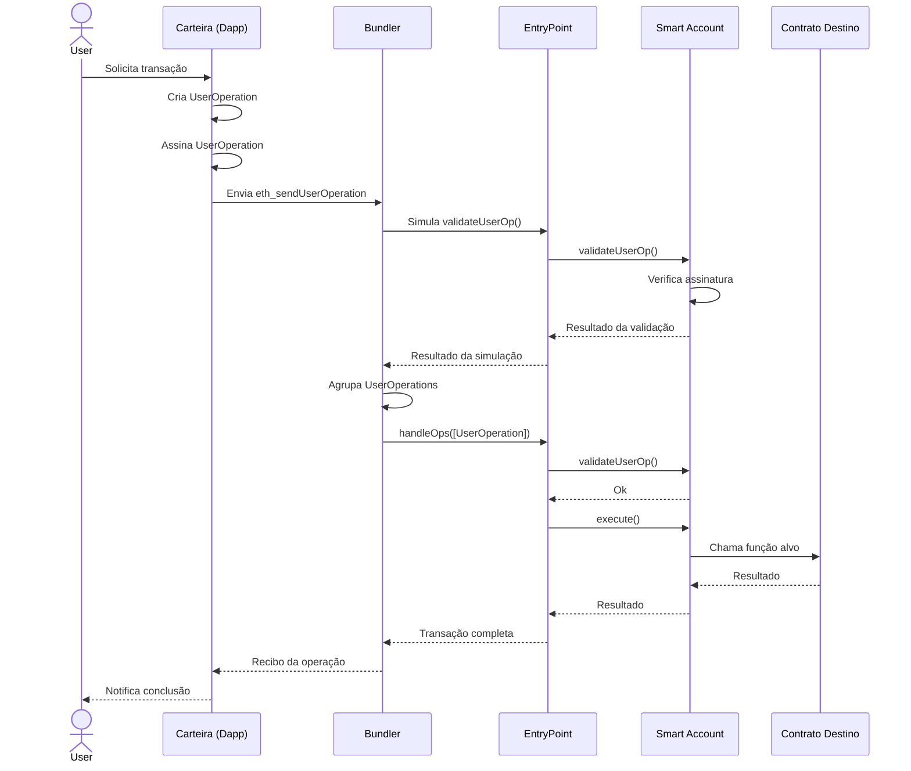
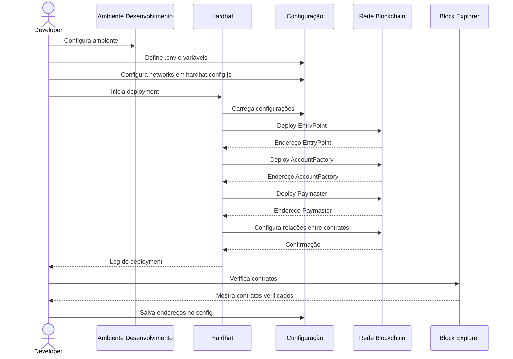
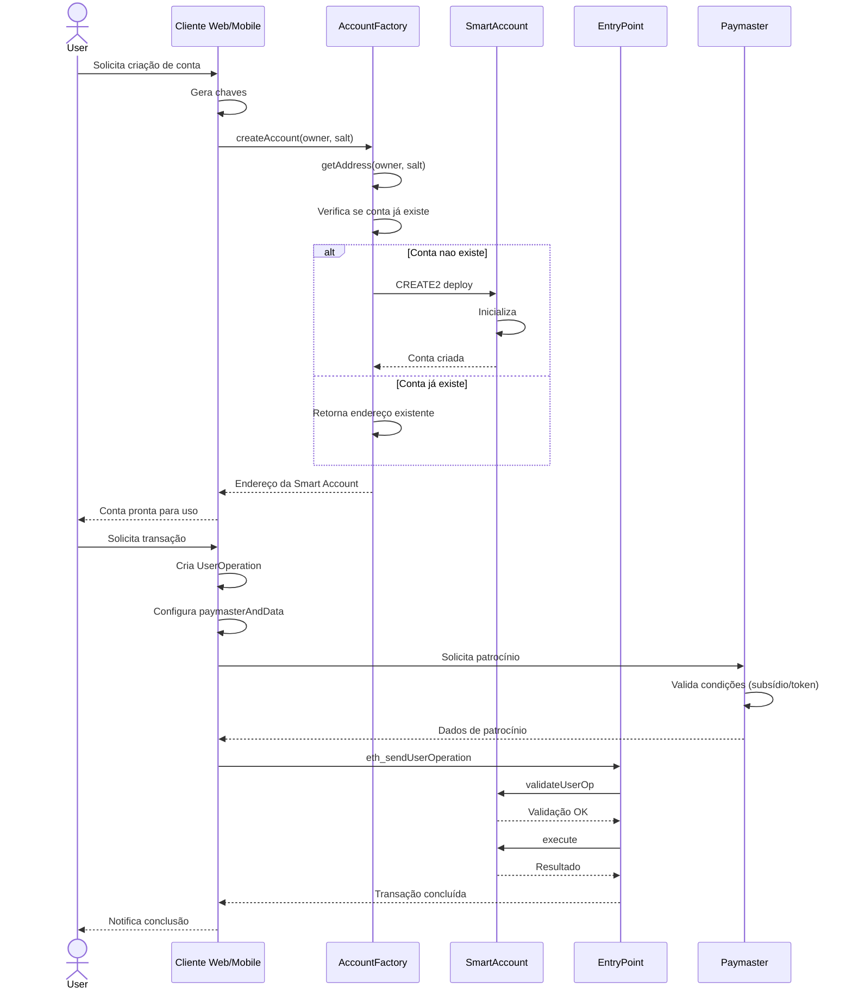
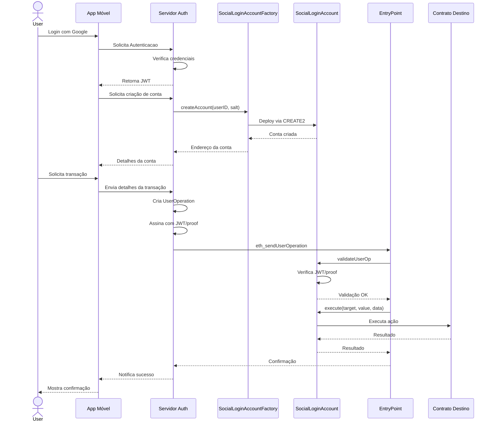
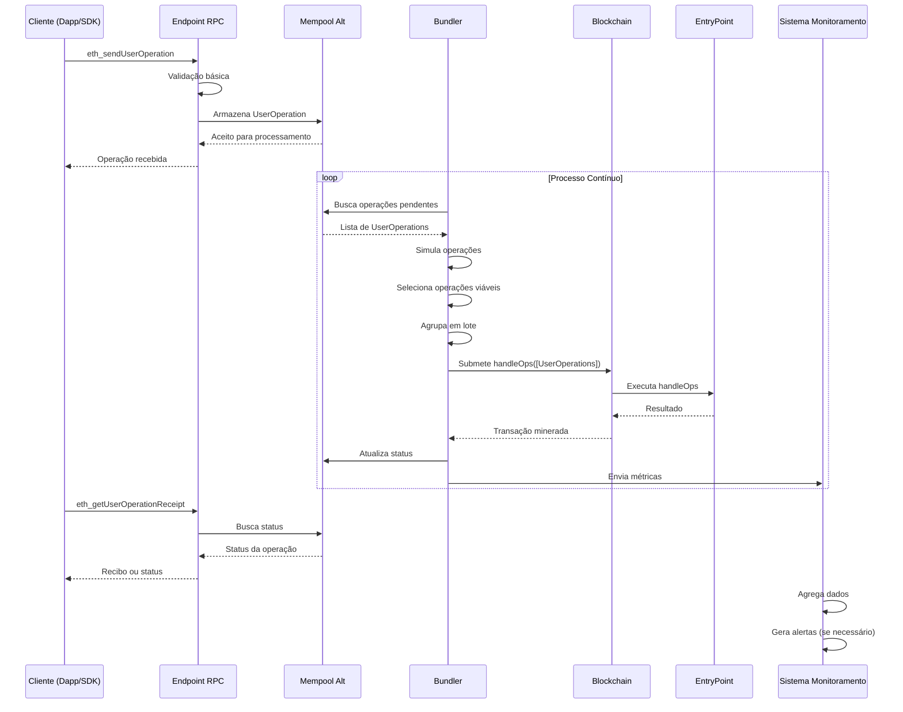
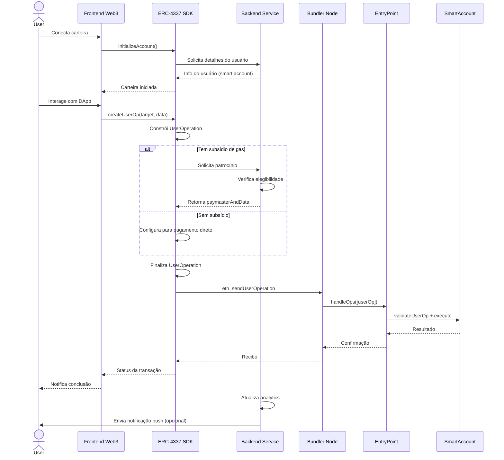
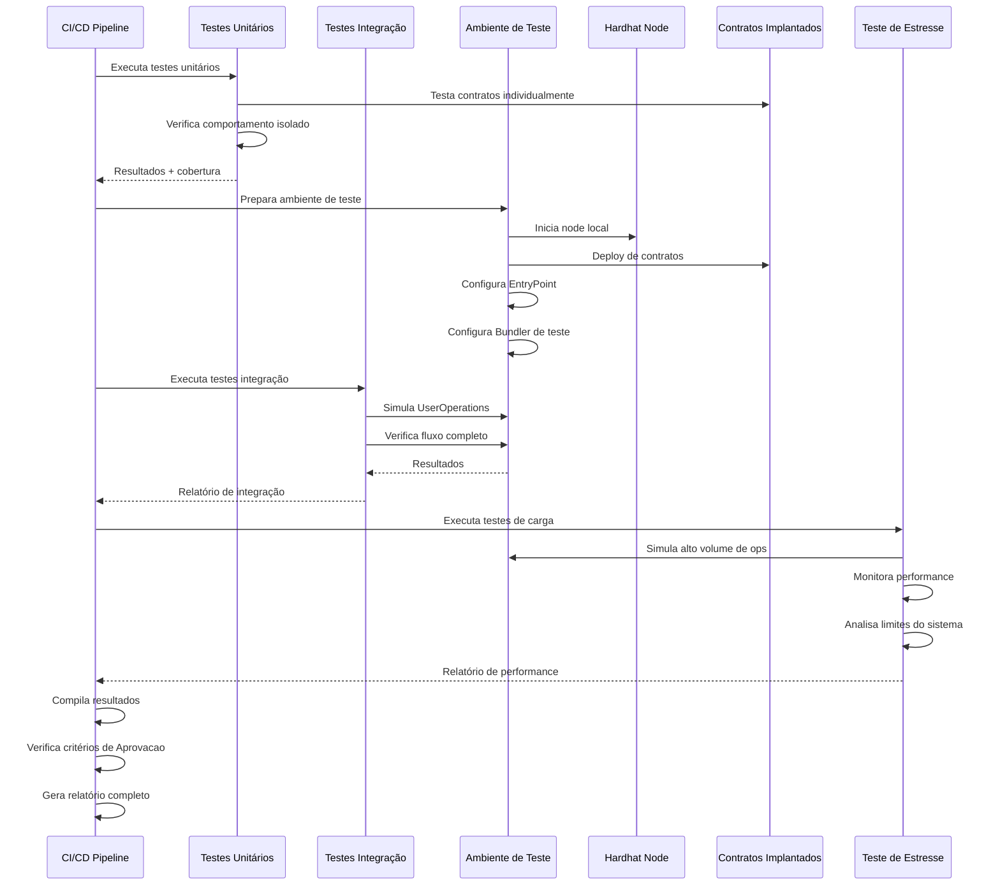

## Diagrama de Classes

Nessa seção, você encontrará diagramas que representam as principais estruturas do projeto ERC-4337.

### Diagrama de Classes do Projeto ERC-4337

```mermaid
classDiagram
    %% Core Account Abstraction
    class EntryPoint {
        +handleOps(UserOperation[] ops)
        +depositTo(address account)
    }
    
    %% Base Accounts
    class BaseAccount {
        <<abstract>>
        +validateUserOp(UserOperation userOp, bytes32 userOpHash) returns (uint256)
        +getNonce() returns (uint256)
    }
    
    %% Auction Related Contracts
    class NFTAuction {
        +Auction[] auctions
        +uint256 auctionCounter
        +IERC20 governanceToken
        +createAuction(address nftContract, uint256 tokenId, uint256 minEthAmount, uint256 minTokenAmount, uint256 duration)
        +placeBid(uint256 auctionId, uint256 tokenAmount)
        +endAuction(uint256 auctionId)
        +claimNFT(uint256 auctionId)
        +claimFunds(uint256 auctionId)
    }
    
    class AccountFactory {
        +EntryPoint entryPoint
        +mapping(address => bool) accountCreated
        +createAccount(address owner, uint256 salt) returns (address)
        +getAddress(address owner, bytes32 salt) returns (address)
    }
    
    class AuctionAccount {
        +IEntryPoint _entryPoint
        +uint256 _nonce
        +execute(address dest, uint256 value, bytes func)
        +executeBatch(address[] dest, uint256[] value, bytes[] func)
        +placeBid(address auction, uint256 nftId, uint256 ethAmount, address governanceToken, uint256 tokenAmount)
        +withdrawEther(address payable recipient, uint256 amount)
        +withdrawTokens(address token, address recipient, uint256 amount)
        +onERC721Received(address operator, address from, uint256 tokenId, bytes data)
    }
    
    %% Other Account Types
    class BiometricAuthAccount {
        +IEntryPoint _entryPoint
        +bytes32[] biometricHashes
        +address[] recoveryAddresses
        +authenticate(bytes biometricData)
        +recoverAccount(bytes32 newBiometricHash)
    }
    
    class SocialRecoveryAccount {
        +IEntryPoint _entryPoint
        +address[] guardians
        +uint256 threshold
        +initiateRecovery(address newOwner)
        +approveRecovery(address newOwner)
        +executeRecovery(address newOwner)
    }
    
    class MultiSigAccount {
        +IEntryPoint _entryPoint
        +address[] signers
        +uint256 threshold
        +proposeTransaction(address dest, uint256 value, bytes data)
        +approveTransaction(uint256 txId)
        +executeTransaction(uint256 txId)
    }
    
    class RecurringPaymentAccount {
        +IEntryPoint _entryPoint
        +mapping paymentSchedules
        +addPaymentSchedule(address receiver, uint256 amount, uint256 interval)
        +executeScheduledPayment(uint256 scheduleId)
        +cancelPaymentSchedule(uint256 scheduleId)
    }

    %% Factory Contracts
    class BiometricAuthAccountFactory {
        +EntryPoint entryPoint
        +createAccount(address owner, bytes32 biometricHash, uint256 salt)
    }
    
    class SocialRecoveryAccountFactory {
        +EntryPoint entryPoint
        +createAccount(address owner, address[] guardians, uint256 threshold, uint256 salt)
    }
    
    class MultiSigAccountFactory {
        +EntryPoint entryPoint
        +createAccount(address[] signers, uint256 threshold, uint256 salt)
    }
    
    class RecurringPaymentAccountFactory {
        +EntryPoint entryPoint
        +createAccount(address owner, uint256 salt)
    }
    
    %% NFT Related Contracts
    class SimpleNFT {
        +mint(address to, string tokenURI)
        +burn(uint256 tokenId)
    }
    
    class AuctionNFT {
        +mint(address to, string tokenURI, uint256 startingPrice)
        +getStartingPrice(uint256 tokenId)
    }
    
    %% Token Contract
    class GovernanceToken {
        +mint(address to, uint256 amount)
        +burn(address from, uint256 amount)
    }
    
    %% Relationships
    BaseAccount <|-- AuctionAccount
    BaseAccount <|-- BiometricAuthAccount
    BaseAccount <|-- SocialRecoveryAccount
    BaseAccount <|-- MultiSigAccount
    BaseAccount <|-- RecurringPaymentAccount
    
    AccountFactory --> AuctionAccount : creates
    BiometricAuthAccountFactory --> BiometricAuthAccount : creates
    SocialRecoveryAccountFactory --> SocialRecoveryAccount : creates
    MultiSigAccountFactory --> MultiSigAccount : creates
    RecurringPaymentAccountFactory --> RecurringPaymentAccount : creates
    
    AuctionAccount --> NFTAuction : interacts
    NFTAuction --> SimpleNFT : manages
    NFTAuction --> AuctionNFT : manages
    NFTAuction --> GovernanceToken : uses
    
    EntryPoint --> BaseAccount : validates & calls
```

## Diagramas de Sequência para ERC-4337

Esta seção contém diagramas de sequência para os principais componentes e fluxos do projeto ERC-4337.

### 1. Fundamentos ERC-4337: Fluxo de Transação

### 2. Config: Processo de Deployment de Smart Accounts

### 3. Contratos Inteligentes: Criação e Uso de Smart Account

### 4. Implementações Práticas: Carteira com Login Social

### 5. Bundler e Infraestrutura: Processamento de UserOperation

### 6. Integrações: Frontend Web3 com Account Abstraction

### 7. Testes e Validação: Processo de Teste End-to-End

Este diagrama de classes representa a estrutura do projeto ERC-4337, mostrando as classes principais e suas relações.

